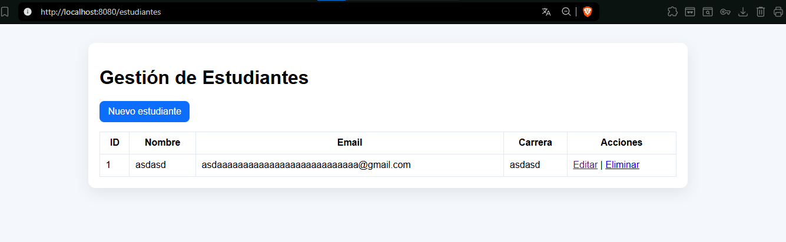
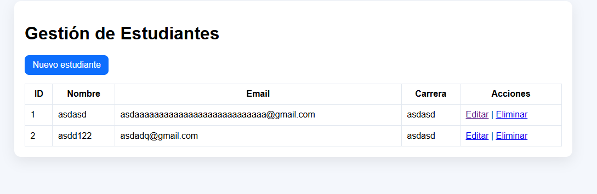
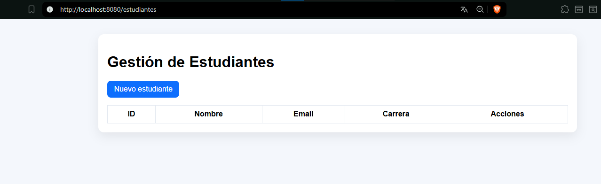
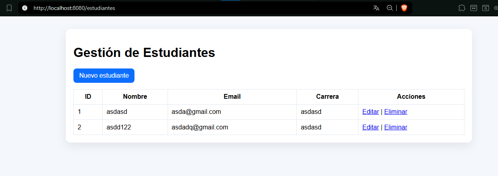

# daza-post1-u8

CRUD de Estudiante con Spring Boot + Spring Data JPA + Hibernate + MySQL.

## Estructura por capas

- model: Estudiante
- repository: EstudianteRepository
- service: EstudianteService
- controller: EstudianteController
- templates/estudiantes: lista, formulario, confirmar-eliminar

## Prerrequisitos

- JDK 17+
- Maven 3.8+
- MySQL 8+
- Base de datos estudiantes_db

## Configuración BD sugerida

- URL: jdbc:mysql://localhost:3306/estudiantes_db
- Usuario: appuser
- Clave: apppass

## Ejecución

1. Crear base de datos y usuario en MySQL
2. Ajustar credenciales en application.properties
3. Ejecutar: mvn spring-boot:run
4. Abrir: <http://localhost:8080/estudiantes>

## Capturas

